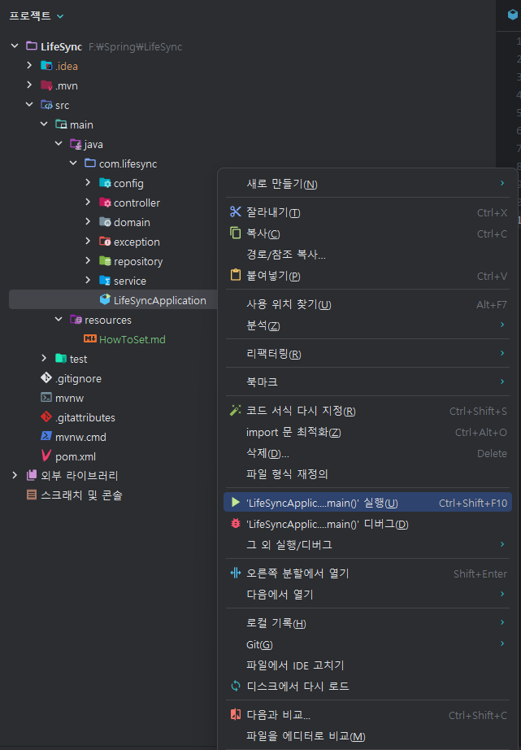

### 초기 properties 세팅

- resources 내부에 application.properties 파일 생성
  - 내용은 [Notion](https://www.notion.so/Spring-Setting-ff4d3cc1006c493c9ee542bcc91f2c6d?pvs=4)
    게시판 - Spring Setting 참고

### 프로젝트 실행

- main/com/lifesync/LifeSyncApplication 우클릭

  
- 이 다음부터는 에디터 위

  
  
  이 부분으로 실행 가능 Or Shift + F10